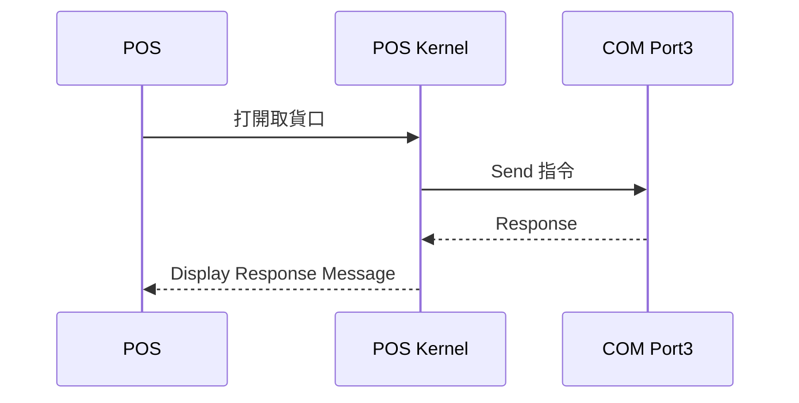

# v0.1 
- 2023/07 確定 Electron + dotnet core 去趨動硬體這條路可行，但需花太多時間排除與dotnet core 相容性的問題，因此放棄此方案
- 確認技術可行性
    - POS: Electron + Edge.js
    - POS Kernel: dotnet core library



## 如何在用 Electron + Vite + Edge 正確開發及打包？
### dotnet core 專案
- nuget 安裝 [EdgeJS 套件](https://www.nuget.org/packages/EdgeJs)
- 佈署時，選擇「獨立式」，才能將 dotnet runtime 環境一併輸出


## Debug 日記
- 2023-06-27 electron-edge-js 版本號問題
    >> The edge module has not been pre-compiled for Electron version x.x.x  . You must build a custom version of edge.node. Please refer to https://github.com/agracio/edge-js for building instructions.
    - root cause 並非版本不相容的問題，而是 electron-edge 找不到它所需要的檔案
        - 如需確認相關套件 (electron, edge, node 等)的相容性，可至 [electron-edge-js 官網](https://github.com/agracio/electron-edge-js)
    - 找不到檔案的主要原因，是 electron-vite 沒有引用 electron-edge 的套件，引用方式：
    ```js
    // 在 electron/preload.ts 中加入以下 require 指令
    const edge = require('electron-edge-js');
    ```
- 2023-06-28 Edge.js.Csharp 找不到問題
    - .net core 專案需安裝 EdgeJS nuget 套件
        - https://www.nuget.org/packages/EdgeJs/
    - preload.ts 需至少呼叫 edge func 一次，相關資源才會順利載入
```js
// preload.ts
const edge = require('electron-edge-js');
const a = edge.func(`
async (input) => { 
  return ".NET Welcomes " + input.ToString(); 
}`)
a("CEIS", function(err: any, rs: any){
  console.log(err)
  console.log(rs)
})
```
- 2023-06-28 System.Runtime 找不到問題
    - 需設定環境變數如下：
```js
// setup in electron/main.ts
const namespace = "QuickStart.Core"
// determine which root path should be used
// replace with real path in your project
let baseNetAppPath = app.isPackaged ? process.resourcesPath : app.getAppPath()
baseNetAppPath = path.join(baseNetAppPath, '/extraResources/quick-start/'+ namespace + "/bin/Debug/netcoreapp3.1")
// Must setup these two env properties
process.env.EDGE_APP_ROOT = baseNetAppPath;
process.env.EDGE_USE_CORECLR = "1"
```

- 關於 build
    - 需在 package.json 設定將DLL 檔案打包的相關規則，如下面的 "extraFiles" 區段，相關說明可參考：https://www.electron.build/configuration/contents.html#extrafiles
    - 可視情況將 extraFiles 改為 extraResources
```js
"build": {
    "directories": {
      "output": "build"
    },
    "asar": false,
    "extraFiles": [
      {
        "from": "./extraResources", //這裡對應的是專案根目錄的位置
        "to": "extraResources", //這裡對應的是app 根目錄的位置
        "filter": [
          "**/*"
        ]
      }
    ]
  }
```
- 2023-07-04 System.PlatformNotSupportedException

> - Message: "System.IO.Ports is currently only supported on Windows."
> - Name:"System.PlatformNotSupportedException"

- replace System.IO.Ports with RJCP.SerialPortStream

> :information_source: 
> - [Electron Packaging Your Application](https://www.electronjs.org/docs/latest/tutorial/tutorial-packaging) 
> - [augment Window interface](https://www.electronjs.org/docs/latest/tutorial/context-isolation#usage-with-typescript)
> - [edge.func definition](https://github.com/agracio/edge-js/blob/0556c156caa78a8c62761b9c0e129173b04f2970/edge-js.d.ts#L2)
> - [Stackoverflow:How to add folders and files to electron build using electron-builder](https://stackoverflow.com/questions/45392642/how-to-add-folders-and-files-to-electron-build-using-electron-builder)
